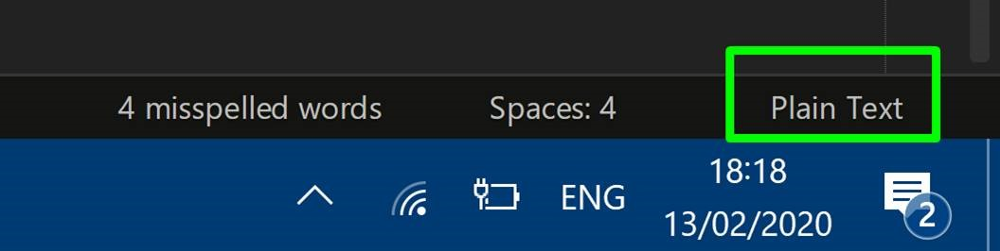
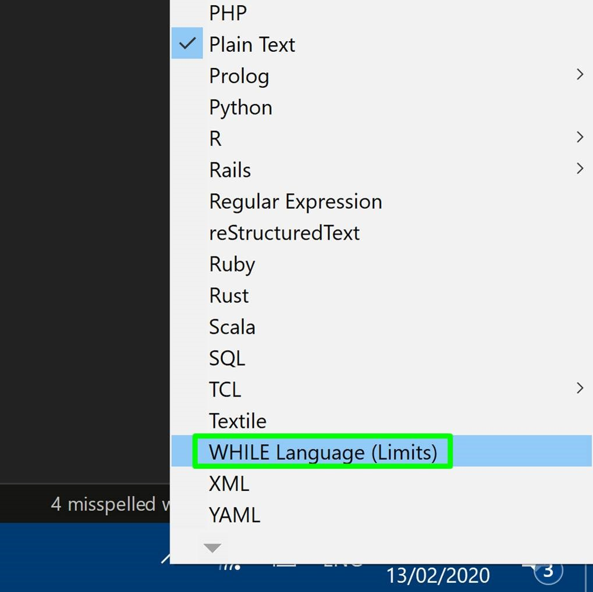
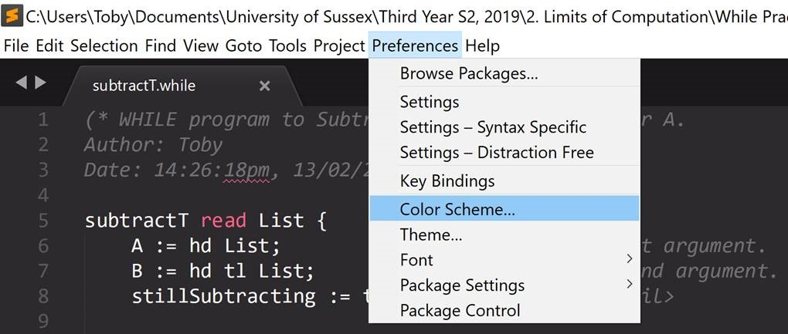
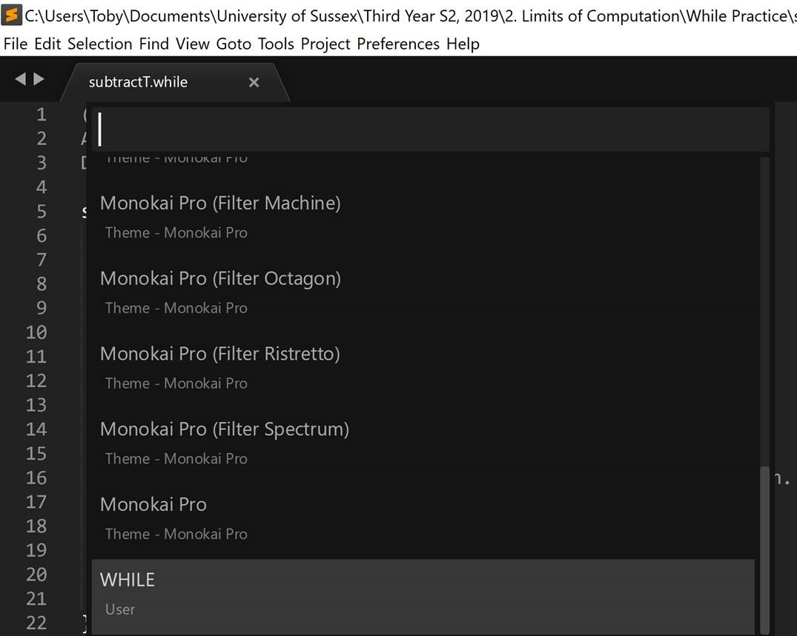

# **WHILE Syntax Highlighter**

<div style="width: 80vw">
    <p>A Sublime Text syntax highlighter for the extended WHILE language, as used in the <a href="https://www.sussex.ac.uk/study/modules/undergraduate/2020/G5029-limits-of-computation" target="_blank" title="About the module">Limits of Computation</a> module at the University of Sussex.</p>
    <p><b>Authors:</b> Toby Dennison; Bernhard Reus.</p>
    <p>Many thanks to Bernhard for reviewing the highlighter's syntax coverage and the suitability of the colours used.</p>
    <p>If you spot any errors, please let us know.</p>
    <p><b>Tip for Speedy WHILE Programming:</b> Download Sublime packages <a href="https://packagecontrol.io/packages/Terminus" target="_blank" title="Get Terminus">Terminus</a> and <a href="https://packagecontrol.io/packages/Origami" target="_blank" title="Get Origami">Origami</a> to open a terminal window *inside of* Sublime and position it where you like, respectively.</p>
    <p><b>Note:</b> The highlighter was not made for <b>Visual Studio Code</b> as it involves a bit more work than Sublime. If anyone wants to have a go at making a VS Code version, please let Bernhard know.</p>
</div>

# Preview


# Installation (Windows/Mac/Linux)

1. Move the two files (WHILE.sublime-syntax, WHILE.sublime-color-scheme) to the appropriate directory, where "```YOUR USERNAME```" is to be replaced.

    **Windows:**<br>
    ```C:\Users\YOUR USERNAME\AppData\Roaming\Sublime Text 3\Packages\User```

    **Mac/Linux:**<br>
    ```/Users/YOUR USERNAME/Library/Application Support/Sublime Text 3/Packages/User```

2. Open a ```.while``` program in Sublime Text.

3. Click on the file format label in the bottom-right corner.<br><br>


4. Scroll down the list of formats and select ‘WHILE Language (Limits)’.<br><br>


5. Change the colour scheme by navigating to ‘Preferences’ > ‘Color Scheme’.<br><br>


6. Select ‘WHILE’ from the list of colour schemes.<br><br>
